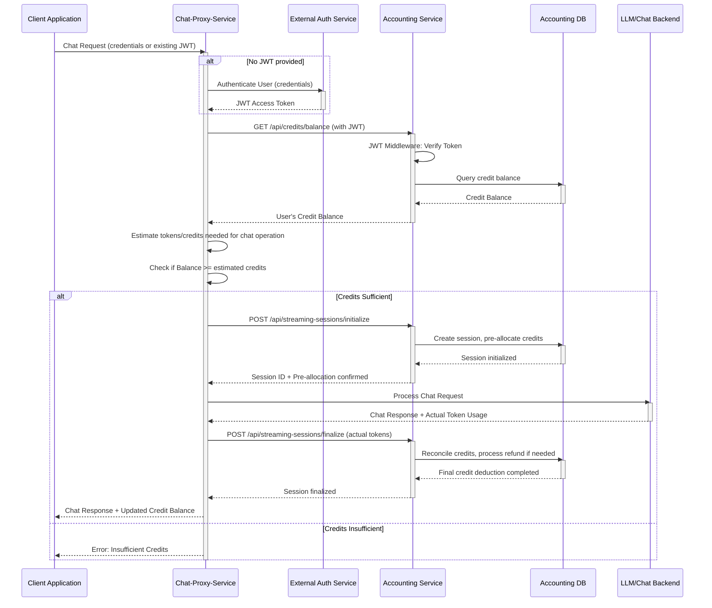

# Accounting Service Features

## 1. Overview

The Accounting Service is responsible for managing user credits, tracking service usage, and handling streaming sessions within the platform. It ensures that users have sufficient credits for operations, records all billable events, and provides mechanisms for administrators to manage user credits and monitor system activity. All interactions with this service are secured using JWT authentication, relying on an external Authentication Service for token generation and initial user validation.

## 2. Core Features

The Accounting Service provides the following core functionalities:

### 2.1. Credit Management

Handles all aspects of user credit balances.

- **Get User Credit Balance**:
  - `GET /api/credits/balance`: Authenticated users can retrieve their own credit balance.
  - `GET /api/credits/balance/:userId`: Administrators and supervisors can retrieve the credit balance of a specific user. The `userId` parameter can be either a user ID or an email address (URL-encoded emails are automatically handled).
- **Check Sufficient Credits**:
  - `POST /api/credits/check`: Allows services to verify if a user has enough credits for a requested operation before execution. Expects `requiredCredits` in the request body.
- **Calculate Credit Cost**:
  - `POST /api/credits/calculate`: Calculates the credit cost for an operation based on parameters like `modelId` and `tokens`.
- **Allocate Credits**:
  - `POST /api/credits/allocate`: Administrators and supervisors can allocate credits to users. Requires `userId`, `credits`, and optionally `expiryDays` and `notes`.
- **Set Absolute Credit Amount**:
  - `POST /api/credits/set`: Administrators and supervisors can set the absolute credit amount for a user, replacing their current balance. Requires `userId`, `credits`, and optionally `expiryDays` and `notes`.
- **Remove/Deduct Credits**:
  - `DELETE /api/credits/remove`: Administrators and supervisors can remove or deduct a specific amount of credits from a user. Requires `userId`, `credits`, and optionally `notes`.
- **Adjust Credits**:
  - `PUT /api/credits/adjust`: Administrators and supervisors can adjust credits by a positive or negative amount. Positive values add credits, negative values subtract credits. Requires `userId`, `adjustment`, and optionally `expiryDays` (for positive adjustments) and `notes`.

### 2.2. Streaming Session Management

Manages the lifecycle of streaming operations, which often involve pre-authorizing and then reconciling credits.

- **Initialize Session**:
  - `POST /api/streaming-sessions/initialize`: Initiates a new streaming session, pre-allocating estimated credits. Requires `sessionId`, `modelId`, and `estimatedTokens`.
- **Finalize Session**:
  - `POST /api/streaming-sessions/finalize`: Concludes a streaming session, reconciling actual token usage (`actualTokens`) against pre-allocated credits and processing refunds if necessary.
- **Abort Session**:
  - `POST /api/streaming-sessions/abort`: Aborts an ongoing streaming session, calculating charges for tokens generated before the abort (`tokensGenerated`) and processing refunds.
- **View Active/Recent Sessions**:
  - `GET /api/streaming-sessions/active`: Users can view their own active sessions.
  - `GET /api/streaming-sessions/active/:userId`: Administrators/supervisors can view active sessions for a specific user.
  - `GET /api/streaming-sessions/active/all`: Administrators can view all active sessions in the system.
  - `GET /api/streaming-sessions/recent`: Administrators/supervisors can view recently concluded or active sessions.
  - `GET /api/streaming-sessions/recent/:userId`: Administrators/supervisors can view recent sessions for a specific user.

### 2.3. Usage Tracking

Records service usage events and provides access to usage statistics.

- **Record Usage Event**:
  - `POST /api/usage/record`: Allows services to record a usage event, including the `service` name, `operation` performed, `credits` consumed, and optional `metadata`.
- **Get Usage Statistics**:
  - `GET /api/usage/stats`: Authenticated users can retrieve their own usage statistics, filterable by date.
  - `GET /api/usage/stats/:userId`: Administrators and supervisors can retrieve usage statistics for a specific user.
  - `GET /api/usage/system-stats`: Administrators can retrieve system-wide usage statistics.

## 3. Authentication

All API endpoints (except `/api/health`) in the Accounting Service are protected and require a valid JSON Web Token (JWT) passed in the `Authorization` header as a Bearer token.

```
Authorization: Bearer <access_token>
```

### 3.1. Interaction with External Authentication Service

- The Accounting Service **does not issue JWTs**. It relies on an external Authentication Service (as described in `ExternalAuthAPIEndpoint.md`) to authenticate users and generate access tokens.
- When a request arrives at the Accounting Service, the `jwt.middleware.ts` intercepts it.
- The middleware verifies the token using a shared secret (e.g., `process.env.JWT_ACCESS_SECRET`). This secret must be identical to the one used by the Authentication Service to sign the tokens.
- The JWT payload is expected to contain user information such as `sub` (subject, used as `userId`), `username`, `email`, and `role`.
- Upon successful verification, the user's information is extracted from the token and attached to the Express `req.user` object, making it available to the controllers.
- The middleware also handles user account synchronization by attempting to find or create a corresponding user record in the Accounting Service's local database (`UserAccount` model) based on the information from the JWT. This ensures that the Accounting Service has a local representation of the user for associating credits and usage.

### 3.2. Role-Based Access Control (RBAC)

- The `role` claim within the JWT is used to enforce role-based access.
- Specific endpoints require `admin` or `supervisor` roles, as detailed in `api.routes.ts` and enforced by `requireAdmin` and `requireSupervisor` middleware.

## 4. Key Workflow Example: API Request with JWT Authentication

This diagram illustrates a typical API request to a protected endpoint in the Accounting Service.

```mermaid
sequenceDiagram
    participant Client as Client Application
    participant AuthExt as External Auth Service
    participant AccSvc as Accounting Service
    participant AccDB as Accounting DB

    Client->>AuthExt: Login Request (credentials)
    activate AuthExt
    AuthExt-->>Client: JWT Access Token
    deactivate AuthExt

    Client->>AccSvc: API Request (e.g., GET /api/credits/balance)
    note right of Client: Includes "Authorization: Bearer <token>" header
    activate AccSvc

    AccSvc->>AccSvc: JWT Middleware: Verify Token
    activate AccSvc #DarkSlateGray
    Note over AccSvc: Uses shared JWT_ACCESS_SECRET
    AccSvc-->>AccSvc: Token Validated, User Info Extracted (userId, role, etc.)
    deactivate AccSvc #DarkSlateGray

    AccSvc->>AccDB: Find/Create UserAccount (based on JWT info)
    activate AccDB
    AccDB-->>AccSvc: UserAccount record
    deactivate AccDB
    Note over AccSvc: req.user populated

    AccSvc->>AccSvc: Controller (e.g., CreditController.getUserBalance)
    activate AccSvc #LightCoral
    AccSvc->>AccDB: Query for credit balance (userId)
    activate AccDB
    AccDB-->>AccSvc: Credit Balance Data
    deactivate AccDB
    AccSvc-->>Client: API Response (e.g., 200 OK with balance)
    deactivate AccSvc #LightCoral
    deactivate AccSvc
```

This workflow demonstrates:

1. The client first obtains a JWT from the External Authentication Service.
2. The client includes this JWT in the `Authorization` header when making requests to the Accounting Service.
3. The Accounting Service's JWT middleware validates the token and extracts user details.
4. The service then processes the request, potentially interacting with its database, and returns a response.

### 4.1. Workflow: Service Usage with Custom Credit Deduction

This workflow illustrates how a client application or another backend service interacts with the Accounting Service to perform an operation that consumes credits. The calling service is responsible for determining the *amount* of credits to deduct based on its own logic or by using the `calculate` endpoint.

1. **Authentication**: The client or calling service first authenticates with an external Authentication Service to obtain a JWT.
2. **Initiate Operation & Get Balance**: The client requests an operation from a primary service (e.g., a Chat Service). This primary service, before proceeding, needs to check the user's credit. It calls the Accounting Service's `GET /api/credits/balance` endpoint (passing the user's JWT) to fetch the current credit balance.
3. **Calculate Cost & Check Sufficiency**: The primary service then calculates the cost of the requested operation. This calculation can be internal to the primary service or it might use the Accounting Service's `POST /api/credits/calculate` endpoint. Once the cost (`requiredCredits`) is known, the primary service checks if the user's fetched balance is sufficient. Alternatively, it can use the `POST /api/credits/check` endpoint.
4. **Perform Operation & Deduct Credits**: If credits are sufficient, the primary service performs its main operation (e.g., processes a chat message, starts a computation). Upon successful completion of its own tasks, it then calls the Accounting Service to deduct the credits. Since the `deductCredits` method within `CreditService` is not directly exposed via a generic "deduct X credits" API endpoint, this deduction typically happens as part of a more specific workflow, like `POST /api/streaming-sessions/finalize` (which internally calls `deductCredits`) or by recording a usage event via `POST /api/usage/record` if that endpoint is configured to also trigger a deduction based on the `credits` field. For a direct custom deduction, a specific internal mechanism or a dedicated (potentially admin-level) endpoint in the primary service would be responsible for determining the amount and then instructing the `CreditService` (possibly through an internal service call if co-located, or a specific trusted API call) to perform the deduction.
5. **Confirmation**: The primary service receives confirmation of the credit deduction and then confirms the successful completion of the overall operation to the client.

```mermaid
sequenceDiagram
    participant ClientApp as Client Application
    participant AuthExt as External Auth Service
    participant PrimarySvc as Primary Service (e.g., Chat Service)
    participant AccSvc as Accounting Service
    participant AccDB as Accounting DB

    ClientApp->>AuthExt: Login Request (credentials)
    activate AuthExt
    AuthExt-->>ClientApp: JWT Access Token
    deactivate AuthExt

    ClientApp->>PrimarySvc: Request Operation (e.g., send message)
    activate PrimarySvc
    PrimarySvc->>AccSvc: GET /api/credits/balance (with JWT)
    activate AccSvc

    AccSvc->>AccSvc: JWT Middleware: Verify Token
    activate AccSvc #DarkSlateGray
    AccSvc-->>AccSvc: Token Validated, User Info Extracted
    deactivate AccSvc #DarkSlateGray
    AccSvc->>AccDB: Query for credit balance (userId)
    activate AccDB
    AccDB-->>AccSvc: Credit Balance Data
    deactivate AccDB
    AccSvc-->>PrimarySvc: User's Credit Balance
    deactivate AccSvc

    PrimarySvc->>PrimarySvc: Calculate/Determine `requiredCredits` for operation
    note right of PrimarySvc: May use AccSvc's /calculate or own logic

    PrimarySvc->>PrimarySvc: Check if Balance >= `requiredCredits`
    alt Credits Sufficient
        PrimarySvc->>PrimarySvc: Perform core operation (e.g., process message)
        PrimarySvc->>AccSvc: Trigger Credit Deduction (e.g., via Finalize Session or Record Usage with credit amount)
        activate AccSvc
        AccSvc->>AccSvc: (Internally) Call CreditService.deductCredits(`userId`, `calculatedAmount`)
        AccSvc->>AccDB: Update credit allocations
        activate AccDB
        AccDB-->>AccSvc: Deduction Confirmed
        deactivate AccDB
        AccSvc-->>PrimarySvc: Deduction Successful
        deactivate AccSvc
        PrimarySvc-->>ClientApp: Operation Successful
    else Credits Insufficient
        PrimarySvc-->>ClientApp: Operation Failed (Insufficient Credits)
    end
    deactivate PrimarySvc
```

### 4.2. Workflow: Chat-Proxy-Service Integration

This workflow demonstrates a simplified architecture where a Chat-Proxy-Service acts as both the client-facing interface and the primary service that manages credit operations. This consolidated approach reduces the complexity of inter-service communication while maintaining proper credit management.

In this scenario, the Chat-Proxy-Service:
- Receives direct requests from client applications
- Manages authentication flow internally
- Handles credit checking and deduction
- Processes chat operations
- Returns consolidated responses to clients



**Key Benefits of Chat-Proxy-Service Architecture:**
