# Authentication-Accounting Service Integration Testing Flow

This document visualizes the test flow in the `workflow_test_Auth_Acc.py` script, which validates the interaction between Authentication and Accounting services.

## Overall Testing Flow

## Test Logger and Reporting System

## Registration Scenario Flow

## Login Scenario Flow

## Credit Allocation Flow

## JWT Security Testing Flow

```mermaid
sequenceDiagram
    participant Script
    participant Acc as Accounting Service
    
    Note over Script,Acc: Test 1: JWT Cross-Service Validation
    
    Script->>Acc: GET /api/credits/balance (User JWT)
    Acc->>Acc: Validate JWT Signature
    Acc->>Acc: Extract User Information
    Acc-->>Script: Balance Response (200)
    
    Note over Script,Acc: Test 2: Invalid JWT Rejection
    
    Script->>Script: Modify JWT Token
    Script->>Acc: GET /api/credits/balance (Modified JWT)
    Acc->>Acc: Detect Invalid Signature
    Acc-->>Script: Unauthorized (401)
    
    Note over Script,Acc: Test 3: Role-Based Access Control
    
    Script->>Acc: GET /api/usage/system-stats (User JWT)
    Acc->>Acc: Validate JWT Signature
    Acc->>Acc: Check User Role ≠ Admin
    Acc-->>Script: Forbidden (403)
```

## JWT Information Flow Between Services

## Shared JWT Secret Security Model

## Test Report Generation

## Conclusion

The workflow test validates the entire JWT-based authentication and authorization flow between the Authentication and Accounting services. It ensures:

1. User registration and verification works correctly
2. JWT tokens are properly issued and contain required information
3. JWT tokens work seamlessly across services without direct database sharing
4. User accounts are automatically created in the Accounting service based on JWT data
5. Credit allocation from admin to users works properly
6. Security mechanisms reject invalid tokens and enforce proper authorization

This microservices design enables a secure and scalable architecture where services trust verified JWT tokens rather than requiring direct database access between services.