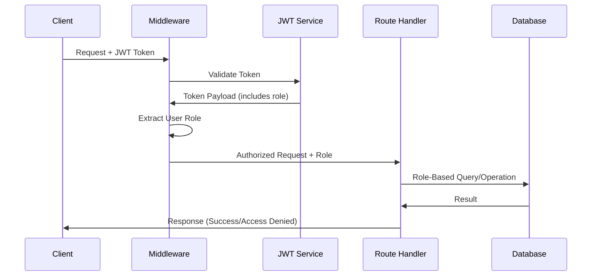
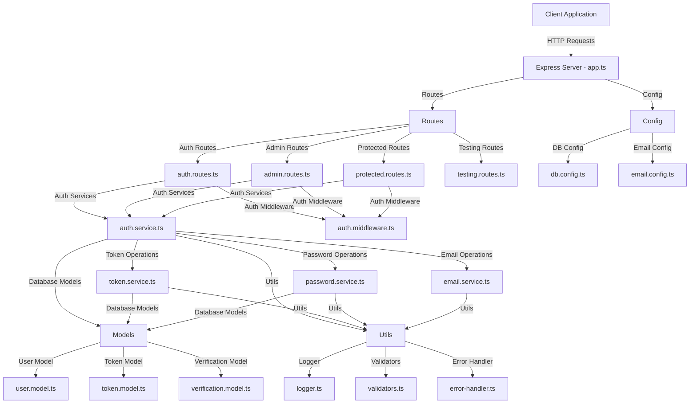
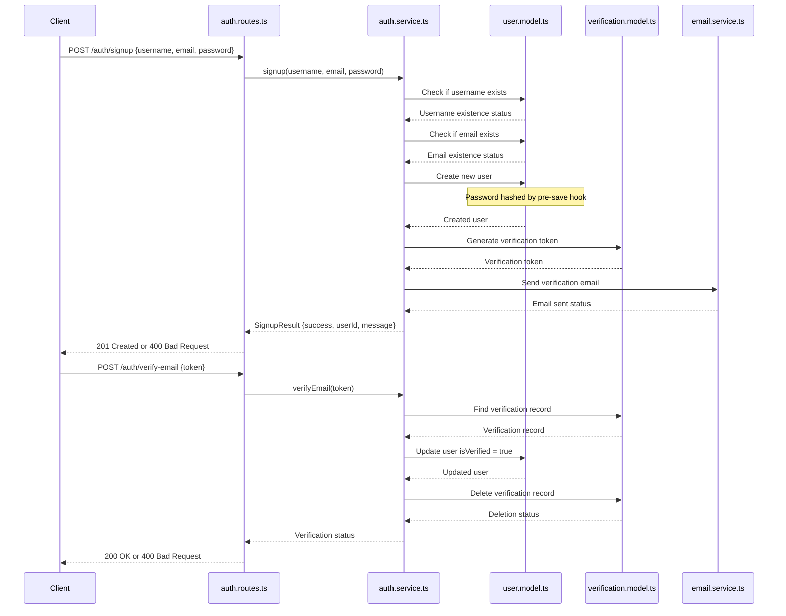
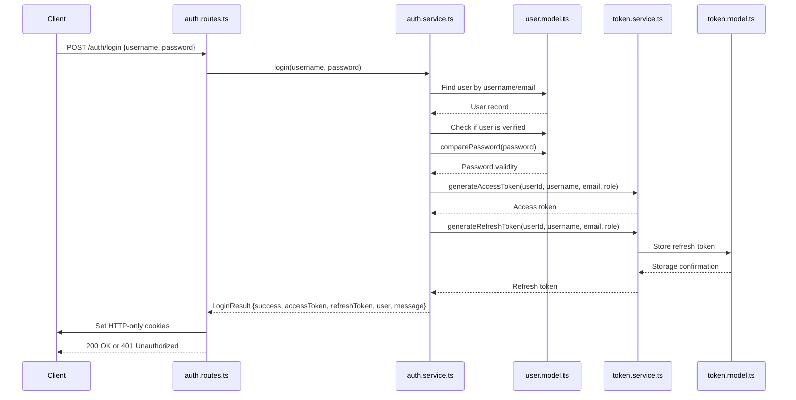
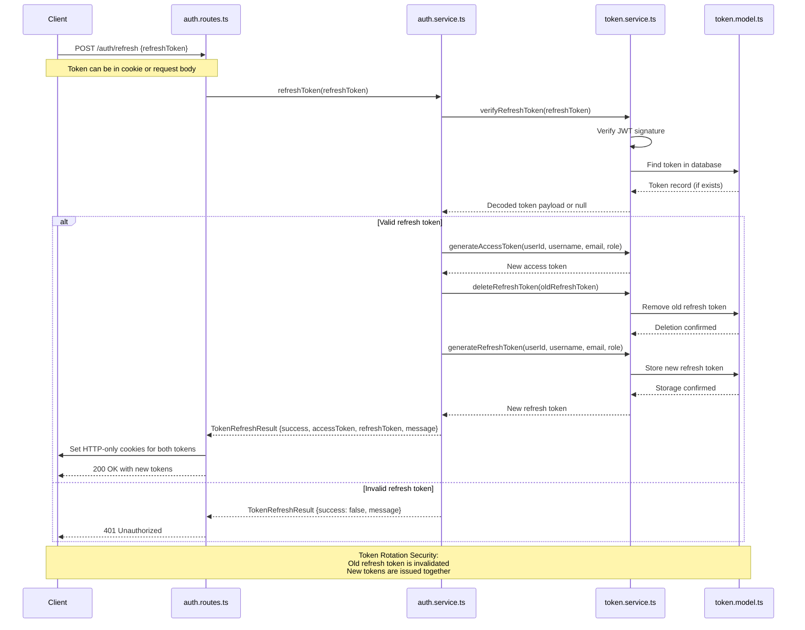
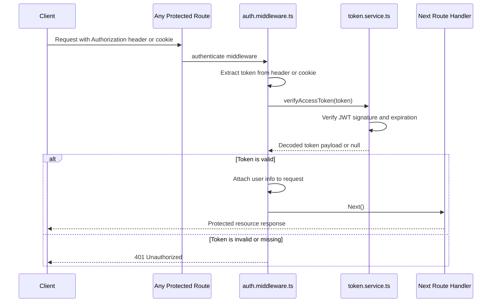
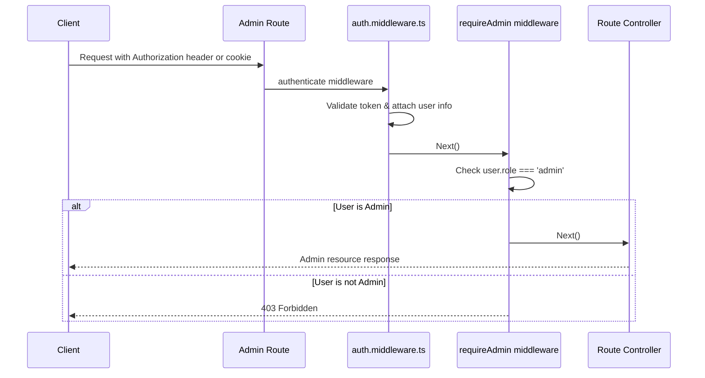
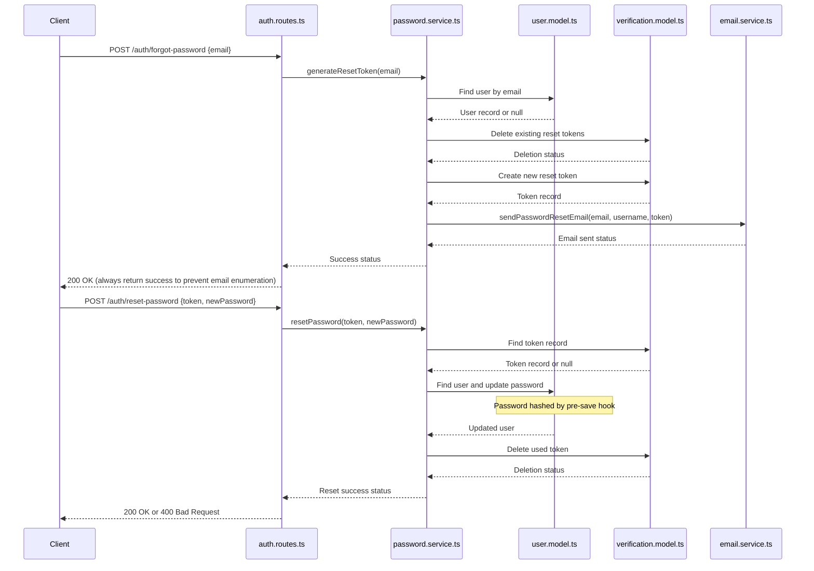
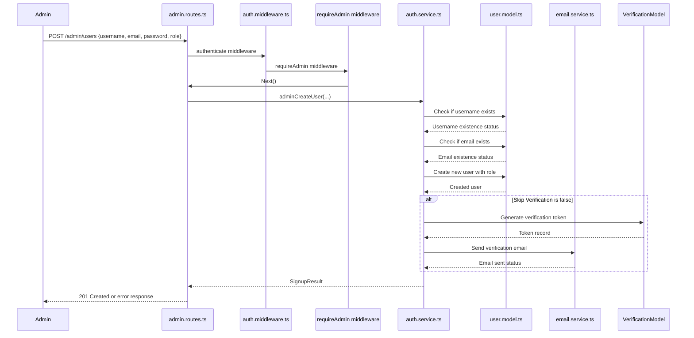
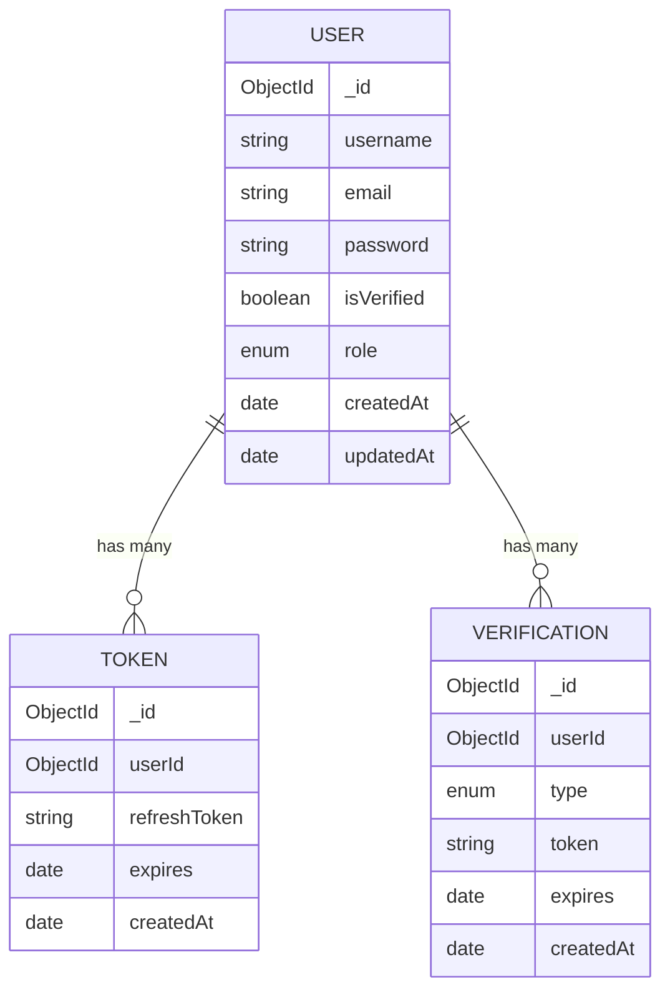

# Authentication Service Code Map

This document provides a comprehensive overview of the authentication service architecture and flows in the Simple Accounting application, including detailed role-based access control implementation.

## Table of Contents

- [Role-Based Access Control](#role-based-access-control)
- [System Architecture](#system-architecture)
- [Authentication Service Architecture](#authentication-service-architecture)
- [JWT Token Service](#jwt-token-service)
- [Authentication Middleware](#authentication-middleware)
- [Password Service](#password-service)
- [Email Service](#email-service)
- [Database Models](#database-models)
- [Service Configuration](#service-configuration)
- [Error Handling](#error-handling)
- [API Routes](#api-routes)

## Role-Based Access Control

The authentication system implements a hierarchical role-based access control (RBAC) system with comprehensive role validation across all service layers.

### Role Constants Implementation

**Definition Location**: `src/models/user.model.ts` (Lines 6-11)

```typescript
export enum UserRole {
  ADMIN = 'admin',        // Highest privilege level
  SUPERVISOR = 'supervisor', // Mid-level privilege  
  ENDUSER = 'enduser',    // Base level access
  USER = 'user'           // Alias for ENDUSER
}
```

### Role Implementation Architecture

```mermaid
graph TD
    A[JWT Token with Role] --> B[Auth Middleware]
    B --> |Extract Role| C[Role Validation]
    C --> |Check Permissions| D{Role Authorization}
    
    D --> |ADMIN| E[Full System Access]
    D --> |SUPERVISOR| F[User Management Access]
    D --> |ENDUSER/USER| G[Standard User Access]
    D --> |Invalid/Missing| H[Access Denied]
    
    E --> I[Admin Routes Accessible]
    F --> J[Limited Admin Features]
    G --> K[Protected Routes Only]
    H --> L[Authentication Required Response]
    
    subgraph "Role Hierarchy"
        M[ADMIN - 'admin']
        N[SUPERVISOR - 'supervisor']
        O[ENDUSER - 'enduser']
        P[USER - 'user' (alias)]
        M --> N
        N --> O
        O --> P
    end
```

### Role Service Integration Points

**Code Locations with Role Implementation:**

1. **User Model** (`src/models/user.model.ts`)
   - Lines 6-11: UserRole enum definition
   - Role property in User interface/model

2. **Authentication Middleware** (`src/auth/auth.middleware.ts`)
   - Lines 89-116: Role-based route protection
   - JWT token role extraction and validation

3. **Admin Routes** (`src/routes/admin.routes.ts`)
   - Role-specific endpoint access control
   - Admin privilege validation

4. **User Creation Service** (`quickCreateAdminPy/create_users.py`)
   - Lines 18-50: Role assignment during user creation
   - Line 156: Admin user creation with role validation

### Role Validation Flow



## System Architecture

The authentication system is built on TypeScript and follows a modular architecture with clear separation of concerns.



## Core Components Overview

### Models

1. **User Model** (`user.model.ts`)
   - Defines the schema for user data
   - Implements password hashing with bcryptjs
   - Provides password comparison method
   - Defines user roles (ADMIN, SUPERVISOR, ENDUSER, USER)

2. **Token Model** (`token.model.ts`)
   - Stores refresh tokens
   - Associates tokens with users
   - Tracks token expiration

3. **Verification Model** (`verification.model.ts`)
   - Stores email verification and password reset tokens
   - Associates verification tokens with users
   - Tracks token expiration

### Services

1. **Auth Service** (`auth.service.ts`)
   - Handles user registration and verification
   - Manages login and authentication
   - Provides token refresh and logout functionality
   - Implements admin user management operations

2. **Token Service** (`token.service.ts`)
   - Generates JWT access and refresh tokens
   - Verifies token validity
   - Manages token storage and deletion

3. **Password Service** (`password.service.ts`)
   - Handles password reset functionality
   - Generates secure random passwords
   - Hashes passwords

4. **Email Service** (`email.service.ts`)
   - Sends verification emails
   - Sends password reset emails
   - Sends notifications for admin-created accounts

### Middleware

1. **Auth Middleware** (`auth.middleware.ts`)
   - **Location**: Lines 89-116 contain role-based access control implementation
   - Authenticates requests using JWT tokens
   - Provides role-based access control with hierarchical permissions
   - Supports optional authentication
   - **Role Implementation**: Extracts user role from JWT payload and validates against required permissions

**Key Role Validation Code** (`src/auth/auth.middleware.ts`, Lines 89-116):
```typescript
// Role-based middleware implementation
const requireRole = (requiredRole: UserRole) => {
  return (req: AuthRequest, res: Response, next: NextFunction) => {
    if (!req.user) {
      return res.status(401).json({ message: 'Authentication required' });
    }
    
    // Role hierarchy validation
    const userRole = req.user.role;
    if (!hasRequiredRole(userRole, requiredRole)) {
      return res.status(403).json({ message: 'Insufficient permissions' });
    }
    
    next();
  };
};
```

**Role-Based Route Protection Examples**:
- **Admin Routes**: `router.use(requireAuth, requireRole(UserRole.ADMIN))`
- **Supervisor Routes**: `router.use(requireAuth, requireRole(UserRole.SUPERVISOR))`
- **General Protected**: `router.use(requireAuth)` (any authenticated user)

### Routes

1. **Auth Routes** (`auth.routes.ts`)
   - User registration and verification
   - Login and logout
   - Password reset

2. **Protected Routes** (`protected.routes.ts`)
   - User profile management
   - Password changes
   - General authenticated user functionality

3. **Admin Routes** (`admin.routes.ts`)
   - User management
   - Batch user creation
   - Role management

4. **Testing Routes** (`testing.routes.ts`)
   - Development and testing utilities

## Authentication Flows

### 1. User Registration and Verification Flow



### 2. User Login Flow



### 3. Token Refresh Flow (with Rotation)



### 4. Authentication Middleware Flow



### 5. Role-Based Access Control Flow



### 6. Password Reset Flow



### 7. Admin User Creation Flow



## Database Schema



## Security Considerations

1. **Password Security**
   - Passwords are hashed using bcryptjs before storage
   - Password requirements enforced (minimum length, complexity)
   - Secure password reset with time-limited tokens

2. **Token Security**
   - JWTs for stateless authentication
   - Short-lived access tokens (15 minutes)
   - HTTP-only cookies for token storage
   - Refresh token rotation

3. **Access Control**
   - Role-based authorization
   - Middleware-based permission checks
   - Route protection

4. **API Security**
   - Rate limiting on authentication endpoints
   - CORS configuration
   - Helmet for HTTP headers security

## Migration Scripts

The system includes migration scripts to help transition data between database versions:

1. **migrate-users.ts** - Migrates user data including role assignment
2. **migrate-tokens.ts** - Migrates refresh tokens 
3. **migrate-verifications.ts** - Migrates verification records
4. **migrate-all.ts** - Orchestrates the complete migration process