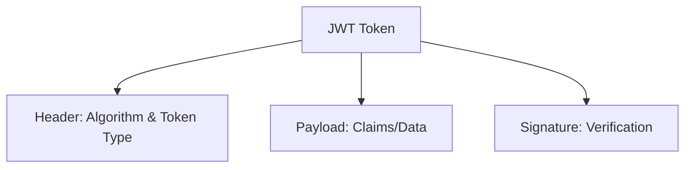
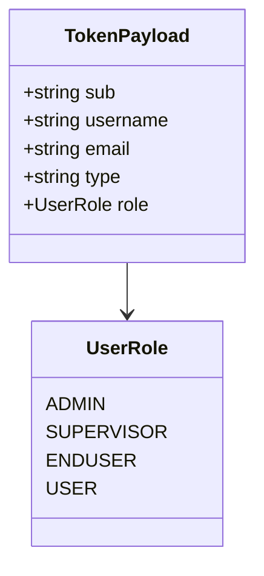
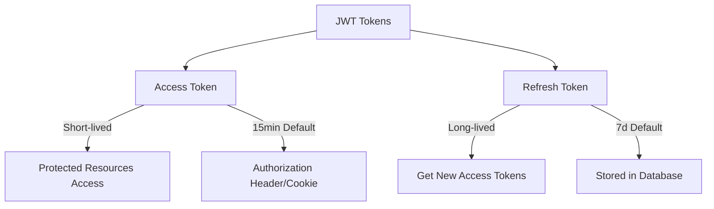
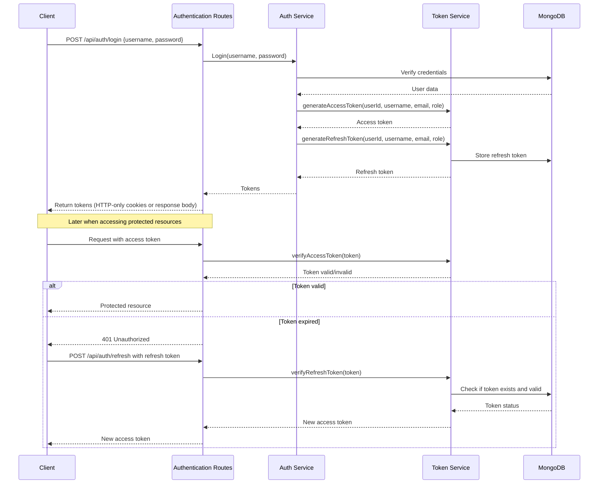
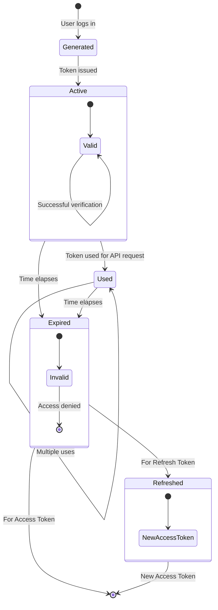
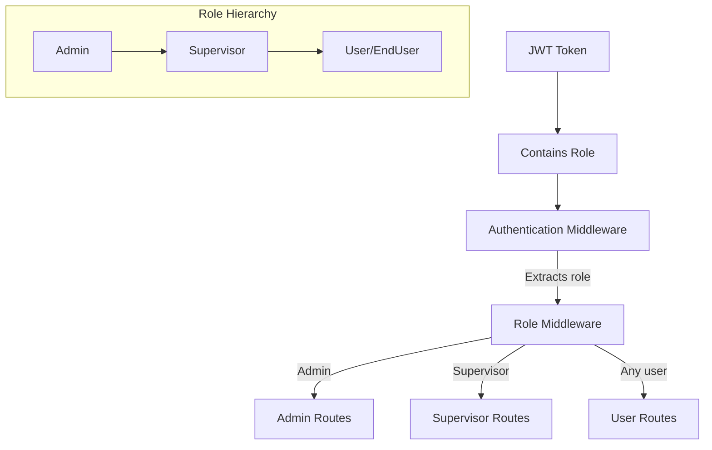
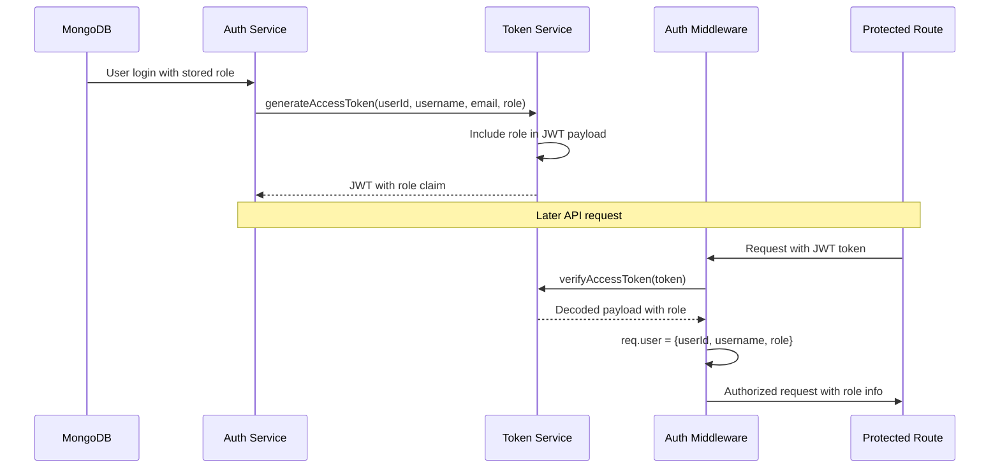
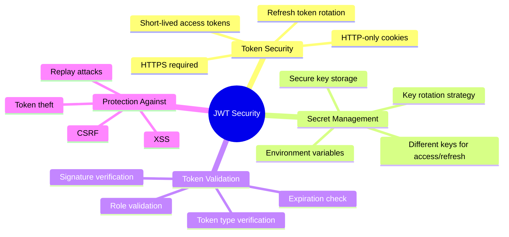
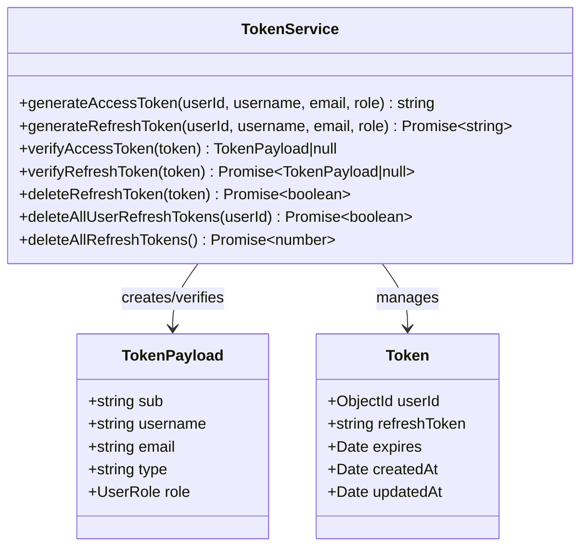
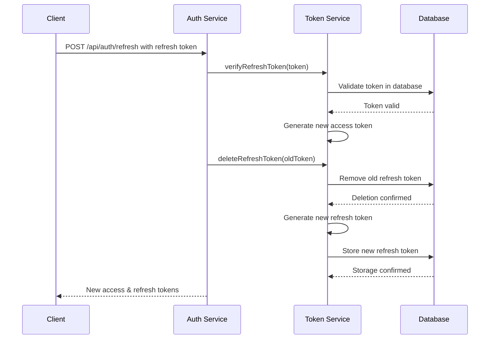

# JWT Design Documentation

This document provides a comprehensive overview of the JWT (JSON Web Token) authentication design implemented in the Simple Accounting Authentication System.

## Table of Contents

- [JWT Design Documentation](#jwt-design-documentation)
  - [Table of Contents](#table-of-contents)
  - [JWT Structure](#jwt-structure)
    - [Header](#header)
    - [Payload](#payload)
    - [Signature](#signature)
  - [Token Types](#token-types)
  - [Authentication Flow](#authentication-flow)
  - [Token Lifecycle](#token-lifecycle)
  - [Role-Based Access Control](#role-based-access-control)
  - [Security Considerations](#security-considerations)
  - [Implementation Details](#implementation-details)
  - [Refresh Token Rotation](#refresh-token-rotation)
  - [Token Storage Strategy](#token-storage-strategy)

## JWT Structure

JSON Web Tokens (JWT) are compact, URL-safe tokens used for securely transmitting information between parties. Each JWT consists of three parts separated by dots (`.`):



### Header

The header typically consists of two parts:
- **alg**: Algorithm used for signing (HS256 in our implementation)
- **typ**: Type of token (JWT)

Example header:
```json
{
  "alg": "HS256",
  "typ": "JWT"
}
```

### Payload

Our token payload contains the following standard and custom claims:



Example payload:
```json
{
  "sub": "user_id_12345",
  "username": "johndoe",
  "email": "john@example.com",
  "type": "access",
  "role": "admin",
  "iat": 1651052800,
  "exp": 1651053700
}
```

### Signature

The signature is created by combining the encoded header and payload with a secret key:

```
HMACSHA256(
  base64UrlEncode(header) + "." + base64UrlEncode(payload),
  secret
)
```

## Token Types

The system uses two types of tokens:



1. **Access Token**
   - Short-lived (default: 15 minutes)
   - Used to access protected resources
   - Contains user identification and role information
   - Stateless - validity checked by signature verification only

2. **Refresh Token**
   - Longer-lived (default: 7 days)
   - Used to obtain new access tokens without re-authentication
   - Stored in database (MongoDB) for validation and revocation
   - Enables token revocation and security monitoring

## Authentication Flow

The flow for authentication using JWTs in the system:



## Token Lifecycle



## Role-Based Access Control

JWT tokens include the user's role, which is used for role-based access control (RBAC):



### Role Constants and Definitions

The authentication system implements a comprehensive role-based access control model with **four distinct role constants** defined in the codebase:

#### UserRole Enum Definition

**Location**: `src/models/user.model.ts` (Lines 6-11)

```typescript
export enum UserRole {
  ADMIN = 'admin',
  SUPERVISOR = 'supervisor', 
  ENDUSER = 'enduser',
  USER = 'user'  // Add USER as an alias for ENDUSER
}
```

#### Role Constant Details

1. **`UserRole.ADMIN = 'admin'`**
   - **Highest privilege level** - Complete system access
   - Can manage users, assign roles, and access all protected routes
   - Set via MongoDB promotion: `db.users.updateOne({username: "admin"}, {$set: {role: "admin", isVerified: true}})`
   - **Evidence Location**: 
     - `quickCreateAdminPy/create_users.py` (Line 156): MongoDB command sets `role: "admin"`
     - `src/auth/auth.middleware.ts` (Line 95): `req.user.role !== UserRole.ADMIN`

2. **`UserRole.SUPERVISOR = 'supervisor'`**
   - **Mid-level privilege** - Access to reports and monitoring features
   - Cannot modify user roles or access system configuration
   - Has all permissions of regular users plus additional oversight capabilities
   - **Evidence Location**:
     - `quickCreateAdminPy/create_users.py` (Lines 23-33): SUPERVISOR_USERS with `"role": "supervisor"`
     - `src/auth/auth.middleware.ts` (Line 112): `req.user.role !== UserRole.SUPERVISOR`

3. **`UserRole.ENDUSER = 'enduser'`**
   - **Base level access** for regular application users
   - Can manage their own profile and use basic application features
   - Cannot access administrative or supervisory functions
   - Default role assigned to new users
   - **Evidence Location**:
     - `quickCreateAdminPy/create_users.py` (Lines 35-50): REGULAR_USERS with `"role": "enduser"`
     - `src/routes/admin.routes.ts` (Line 45): `role || UserRole.ENDUSER`

4. **`UserRole.USER = 'user'`**
   - **Alias for ENDUSER** - Functionally identical to EndUser role
   - Provides compatibility with systems that expect "user" as a role name
   - Can be used interchangeably with ENDUSER in API calls
   - **Evidence Location**:
     - `src/models/user.model.ts` (Line 10): Comment indicates "Add USER as an alias for ENDUSER"

### Role Implementation Architecture

#### Role Storage and Propagation Flow



#### Role-Based Middleware Implementation

**Location**: `src/auth/auth.middleware.ts`

```typescript
// Lines 89-100: Admin-only access control
export const requireAdmin = (req: Request, res: Response, next: NextFunction) => {
  if (!req.user) {
    return res.status(401).json({ error: 'Authentication required' });
  }
  
  if (req.user.role !== UserRole.ADMIN) {
    return res.status(403).json({ error: 'Admin access required' });
  }
  
  next();
};

// Lines 105-116: Supervisor and Admin access control  
export const requireSupervisor = (req: Request, res: Response, next: NextFunction) => {
  if (!req.user) {
    return res.status(401).json({ error: 'Authentication required' });
  }
  
  if (req.user.role !== UserRole.SUPERVISOR && req.user.role !== UserRole.ADMIN) {
    return res.status(403).json({ error: 'Supervisor access required' });
  }
  
  next();
};
```

### Code Locations and Implementation Details

#### 1. Role Creation and Assignment

**Admin User Creation Flow** (`quickCreateAdminPy/create_users.py`):
- **Lines 18-22**: Admin user defined without role field
- **Lines 156**: MongoDB promotion: `$set: { role: "admin", isVerified: true }`
- **Lines 23-33**: Supervisor users with explicit `"role": "supervisor"`
- **Lines 35-50**: Regular users with explicit `"role": "enduser"`

#### 2. JWT Token Integration

**Token Payload Structure** (`src/auth/token.service.ts`):
```typescript
const payload: TokenPayload = {
  sub: userId,
  username,
  email,
  type: 'access',
  role  // Role included in every JWT token
};
```

**Token Verification** (`src/auth/auth.middleware.ts`, Lines 45-52):
```typescript
req.user = {
  userId: decoded.sub,
  username: decoded.username,
  role: decoded.role  // Role extracted from JWT and attached to request
};
```

#### 3. Route Protection Implementation

**Admin Routes** (`src/routes/admin.routes.ts`, Line 13):
```typescript
router.get('/users', authenticate, requireAdmin, async (req: Request, res: Response) => {
  // Only users with UserRole.ADMIN can access
});
```

**Supervisor Routes** (`src/routes/admin.routes.ts`, Line 287):
```typescript
router.get('/reports', authenticate, requireSupervisor, (req: Request, res: Response) => {
  // Users with UserRole.SUPERVISOR or UserRole.ADMIN can access
});
```

#### 4. Role Validation in API Operations

**User Creation with Role Validation** (`src/routes/admin.routes.ts`, Lines 31-37):
```typescript
// Validate role if provided
if (role && !Object.values(UserRole).includes(role)) {
  return res.status(400).json({ error: 'Invalid role' });
}

// Prevent non-admins from creating admin users
if (role === UserRole.ADMIN) {
  logger.warn(`Admin user creation attempt by ${req.user?.username} - This action is restricted`);
  return res.status(403).json({ error: 'Creating admin users is restricted' });
}
```

#### 5. Security Restrictions

**Admin Creation Restrictions** (`src/routes/admin.routes.ts`, Lines 83-91):
```typescript
// Prevent creating admin users
if (user.role === UserRole.ADMIN) {
  logger.warn(`Batch admin user creation attempt by ${req.user?.username} - This action is restricted`);
  return res.status(403).json({ 
    error: 'Creating admin users is restricted',
    invalidUser: user
  });
}
```

**Admin Deletion Protection** (`src/routes/admin.routes.ts`, Lines 215-219):
```typescript
// Check if trying to delete another admin (additional security)
if (user.role === UserRole.ADMIN) {
  logger.warn(`Admin ${req.user?.username} attempted to delete another admin ${user.username}`);
  return res.status(403).json({ error: 'Cannot delete another admin user' });
}
```

### Role Hierarchy and Permissions

The system enforces a **hierarchical permission structure**:

```mermaid
graph TD    A[Admin Role] -->|Inherits all permissions| B[Supervisor Role]
    B -->|Inherits all permissions| C[EndUser/User Role]
    
    A --> A1[User Management]
    A --> A2[System Configuration] 
    A --> A3[All API Endpoints]
    
    B --> B1[Reports Access]
    B --> B2[Monitoring Features]
    B --> B3[Basic User Functions]
    
    C --> C1[Profile Management]
    C --> C2[Basic Application Features]
    
    classDef adminRole fill:#E53935,stroke:#C62828,color:white;
    classDef supervisorRole fill:#FB8C00,stroke:#EF6C00,color:white;
    classDef userRole fill:#43A047,stroke:#2E7D32,color:white;    
    class A adminRole
    class B supervisorRole
    class C userRole
```

This detailed role implementation ensures secure, granular access control throughout the JWT-based authentication system.

## Security Considerations



## Implementation Details

The JWT implementation is primarily contained in the TokenService class:



## Refresh Token Rotation

The system implements a refresh token rotation mechanism to enhance security:



## Token Storage Strategy

```mermaid
flowchart TD
    A[JWT Token] --> B{Token Type}
    B -->|Access Token| C[Client Storage Options]
    B -->|Refresh Token| D[Server Storage]
    
    C --> C1[HTTP-only Cookie]
    C --> C2[Authorization Header]
    
    D --> D1[MongoDB]
    D1 --> D2[Token Collection]
    
    D2 --> E[Document Structure]
    E --> E1[userId: ObjectId]
    E --> E2[refreshToken: String]
    E --> E3[expires: Date]
    
    E --> F[Indexes]
    F --> F1[TTL Index on expires]