# Technical Documentation: TypeScript Authentication System

This document provides a comprehensive technical overview of the TypeScript Authentication System. It includes background knowledge for those unfamiliar with Node.js, MongoDB, and Express.js; essential short examples; database structure; API architecture; authentication workflows; testing methodologies; security considerations; role-based access control; admin APIs; and more.

## Introduction to Key Technologies

To fully understand this authentication system's architecture and implementation, familiarity with key technologies used is beneficial. This section provides a brief overview of Node.js, Express.js (often referred to as Express), and MongoDB.

### Node.js

Node.js is a JavaScript runtime built on Chrome's V8 JavaScript engine. It allows developers to run JavaScript on the server-side. Node.js is known for its event-driven architecture and non-blocking I/O model.

**Example: Creating a simple HTTP server**

```javascript
const http = require('http');

const server = http.createServer((req, res) => {
  res.statusCode = 200;
  res.setHeader('Content-Type', 'text/plain');
  res.end('Hello World\n');
});

server.listen(3000, () => {
  console.log('Server running on port 3000');
});
```

### Express.js

Express.js is a minimal and flexible Node.js web application framework that provides features for web and mobile applications. It simplifies building APIs and web servers by handling routing and middleware.

**Example: Setting up a basic Express server**

```javascript
const express = require('express');
const app = express();
const port = 3000;

app.get('/', (req, res) => {
  res.send('Hello World!');
});

app.listen(port, () => {
  console.log(`Example app listening at [invalid url, do not cite]);
});
```

### MongoDB

MongoDB is a NoSQL database that stores data in flexible documents. It’s designed for scalability and flexibility. Unlike relational databases (e.g., MySQL), MongoDB does not require a fixed schema.

**Example: Connecting to MongoDB and inserting a document**

```javascript
const { MongoClient } = require('mongodb');

async function connect() {
  const uri = "mongodb://localhost:27017";
  const client = new MongoClient(uri);

  try {
    await client.connect();
    await client.db("mydatabase").collection("mycollection").insertOne({ name: "John Doe", age: 30 });
    console.log("Document inserted");
  } catch (err) {
    console.error(err);
  } finally {
    await client.close();
  }
}

connect();
```

These technologies form the foundation of this authentication system.

---

## Table of Contents

1. [System Architecture](#system-architecture)
2. [Database Structure](#database-structure)
3. [API Structure](#api-structure)
4. [Authentication Workflows](#authentication-workflows)
5. [API Usage Steps](#api-usage-steps)
6. [Role-Based Access Control](#role-based-access-control)
7. [Admin API for User Management](#admin-api-for-user-management)
8. [Testing Scope](#testing-scope)
9. [Security Considerations](#security-considerations)

---

## System Architecture

The authentication system follows a modern Node.js/Express architecture with TypeScript for type safety and MongoDB for data persistence.

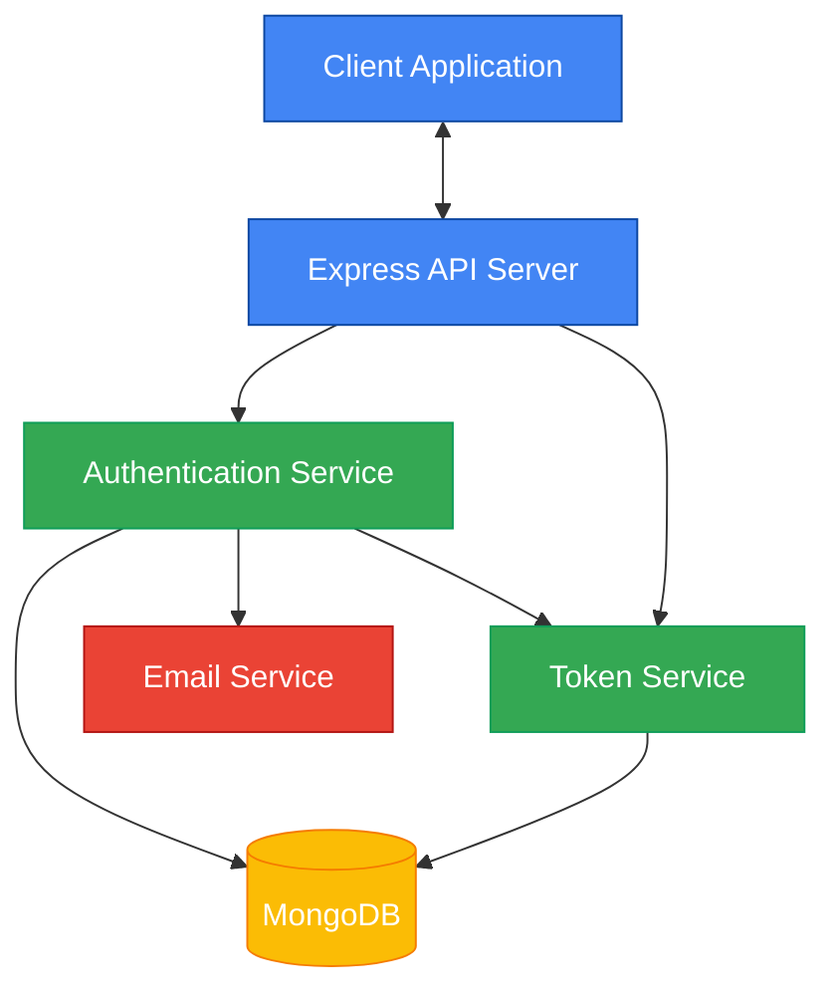

---

## Database Structure

The system uses MongoDB with three primary collections: Users, Tokens, and Verifications. Below is a diagram showing the database schema and relationships:

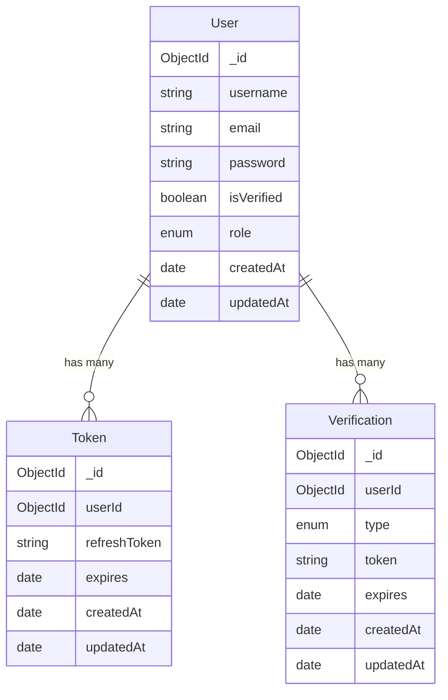

### Collection Details

#### User Collection
- Stores user credentials and profile information
- Password is hashed using bcrypt before storage
- Includes role information for access control (admin, supervisor, enduser)
- Tracks verified status for email verification

#### Token Collection
- Stores refresh tokens for maintaining user sessions
- Includes expiration dates for security
- TTL index automatically removes expired tokens
- References user by userId

#### Verification Collection
- Supports multiple verification types (email, password reset)
- Stores verification tokens with expiration dates
- TTL index automatically removes expired verifications
- References user by userId

---

## API Structure

The API is organized into route modules using Express.js. Routes define endpoints that clients can interact with,
while middleware functions handle tasks such as authentication and error handling.

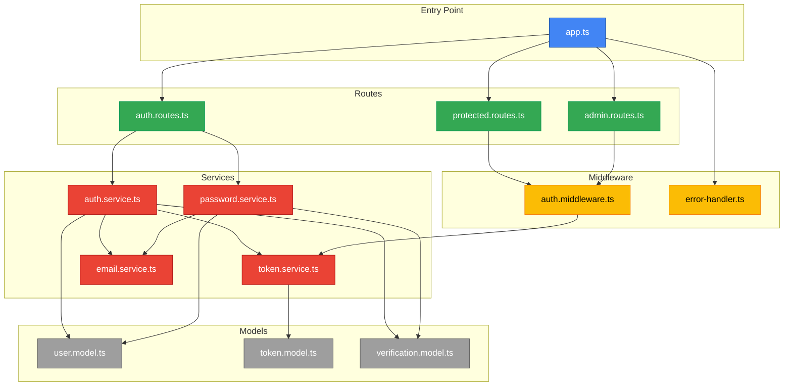

### API Endpoints

#### Auth Routes (`/api/auth`)

| Endpoint                       | Method | Description                           | Access Level      |
|--------------------------------|--------|---------------------------------------|-------------------|
| `/api/auth/signup`             | POST   | Register a new user                   | Public            |
| `/api/auth/verify-email`       | POST   | Verify email with token               | Public            |
| `/api/auth/resend-verification`| POST   | Resend verification code              | Public            |
| `/api/auth/login`              | POST   | Login with credentials                | Public            |
| `/api/auth/refresh`            | POST   | Refresh access token                  | Public            |
| `/api/auth/logout`             | POST   | Logout (invalidate token)             | Public            |
| `/api/auth/logout-all`         | POST   | Logout from all devices               | Authenticated     |
| `/api/auth/forgot-password`    | POST   | Request password reset                | Public            |
| `/api/auth/reset-password`     | POST   | Reset password with token             | Public            |

#### Protected Routes (`/api/protected`)

| Endpoint                       | Method | Description                           | Access Level      |
|--------------------------------|--------|---------------------------------------|-------------------|
| `/api/protected/profile`       | GET    | Get user profile                      | Authenticated     |
| `/api/protected/profile`       | PUT    | Update user profile                   | Authenticated     |
| `/api/protected/change-password`| POST  | Change password                       | Authenticated     |
| `/api/protected/dashboard`     | GET    | Access protected dashboard content    | Authenticated     |

#### Admin Routes (`/api/admin`)

| Endpoint                       | Method | Description                           | Access Level      |
|--------------------------------|--------|---------------------------------------|-------------------|
| `/api/admin/users`             | GET    | Get all users                         | Admin             |
| `/api/admin/users`             | POST   | Create a new user                     | Admin             |
| `/api/admin/users`             | DELETE | Delete all users                      | Admin             |
| `/api/admin/users/:userId`     | DELETE | Delete a specific user                | Admin             |
| `/api/admin/users/:userId/role`| PUT    | Update user role                      | Admin             |
| `/api/admin/reports`           | GET    | Access reports                        | Admin/Supervisor  |
| `/api/admin/dashboard`         | GET    | Access dashboard                      | Any Authenticated |

#### Testing Routes (`/api/testing`) - Development Only

| Endpoint                                | Method | Description                           | Access Level      |
|-----------------------------------------|--------|---------------------------------------|-------------------|
| `/api/testing/verification-token/:userId/:type?` | GET  | Get verification token for a user     | Development       |
| `/api/testing/verify-user/:userId`      | POST   | Directly verify a user without token  | Development       |

#### Miscellaneous Endpoints

| Endpoint                       | Method | Description                           | Access Level      |
|--------------------------------|--------|---------------------------------------|-------------------|
| `/health`                      | GET    | Health check endpoint                 | Public            |

---

## Authentication Workflows

The system implements several authentication workflows:

### Registration and Email Verification

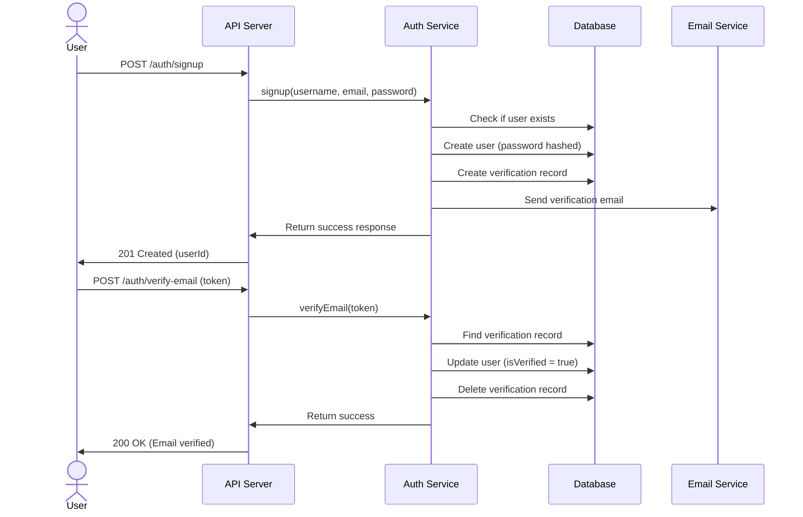

**Implementation Example:**

```javascript
// Pseudo-code for illustration
app.post('/auth/signup', async (req, res) => {
    const { username, email, password } = req.body;
    // Validate input
    // Check if user exists
    // Hash password
    // Create user
    // Generate verification token
    // Save verification record
    // Send verification email
    // Return success response
});
```

### Login and Token Refresh

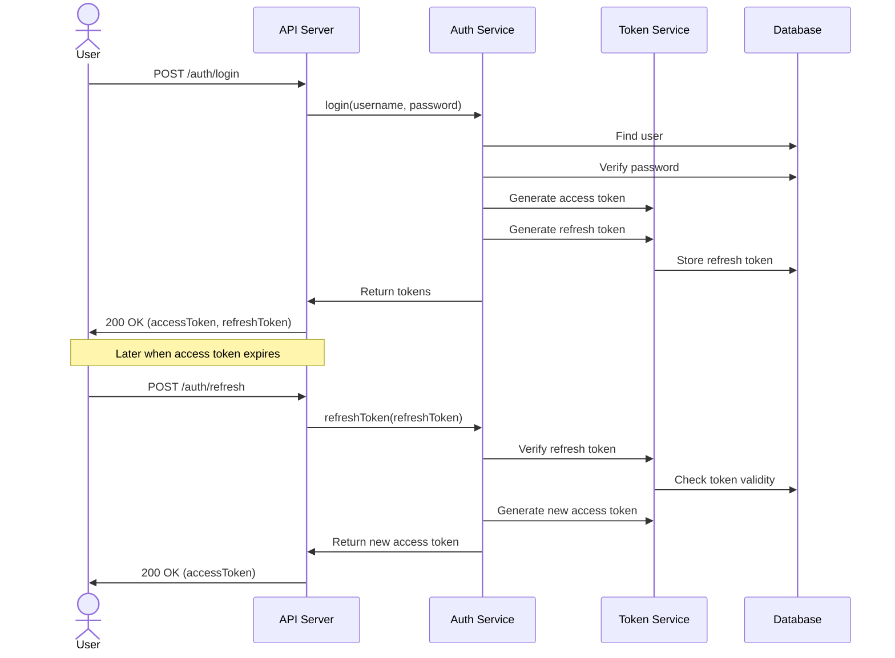

**Implementation Example:**

```javascript
// Pseudo-code for illustration
app.post('/auth/login', async (req, res) => {
    const { username, password } = req.body;
    // Find user
    // Verify password
    // Generate access token
    // Generate refresh token
    // Store refresh token
    // Return tokens
});

app.post('/auth/refresh', async (req, res) => {
    const { refreshToken } = req.body;
    // Verify refresh token
    // Check token validity
    // Generate new access token
    // Return new access token
});
```

### Password Reset Flow

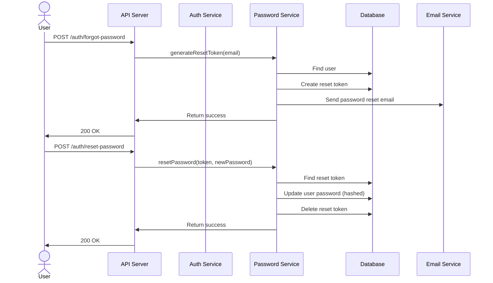

**Implementation Example:**

```javascript
// Pseudo-code for illustration
app.post('/auth/forgot-password', async (req, res) => {
    const { email } = req.body;
    // Find user
    // Generate reset token
    // Create reset token record
    // Send reset email
    // Return success
});

app.post('/auth/reset-password', async (req, res) => {
    const { token, newPassword } = req.body;
    // Find reset token
    // Verify token
    // Update user password
    // Delete reset token
    // Return success
});
```

---

## API Usage Steps

Here's a step-by-step guide for implementing authentication in a client application:

### User Registration Flow

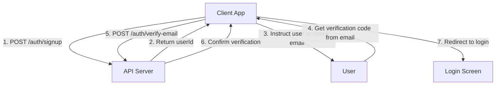

### Authentication Flow

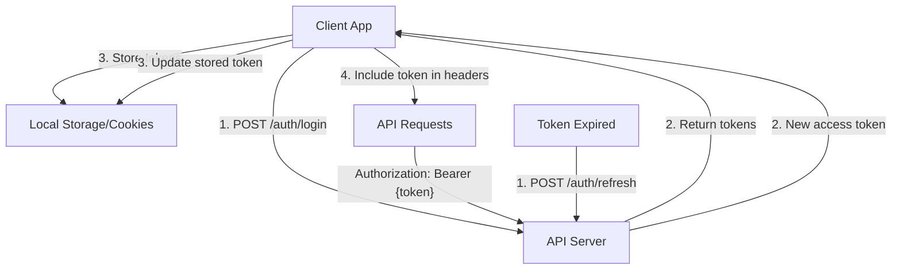

---

## Role-Based Access Control

The authentication system implements a comprehensive role-based access control (RBAC) model with three distinct user roles arranged in a hierarchical permission structure. This allows for fine-grained control over who can access which parts of the application.

### Role Hierarchy

The system enforces a strict role hierarchy where higher-level roles inherit all permissions from lower-level roles:

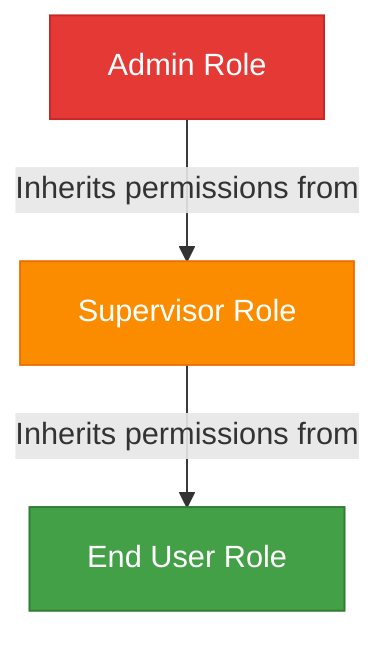

### Role Definitions

1. **Admin Role (`UserRole.ADMIN`)**: 
   - System administrators with full access to all functionality
   - Can manage users, assign roles, and access all protected routes
   - Typically assigned to technical staff or organization leadership
   - Has access to user management and system configuration

2. **Supervisor Role (`UserRole.SUPERVISOR`)**: 
   - Mid-level access for team managers or supervisors
   - Can access reporting and monitoring features
   - Cannot modify user roles or access system configuration
   - Has all the permissions of regular end users plus additional oversight capabilities

3. **End User Role (`UserRole.ENDUSER`)**: 
   - Base level access for regular application users
   - Can manage their own profile and use basic application features
   - Cannot access administrative or supervisory functions
   - Default role assigned to all new users

4. **User Role (`UserRole.USER`)**: 
   - Alias for `UserRole.ENDUSER`
   - Functionally identical to the End User role
   - Provides compatibility with systems that expect "user" as a role name
   - Can be used interchangeably with ENDUSER in API calls

### Access Control Implementation

The role-based access control is implemented through middleware functions in the `auth.middleware.ts` file:

1. **Authentication Middleware** (`authenticate`): 
   - Verifies JWT tokens for all protected routes
   - Supports both header and cookie-based authentication
   - Attaches user information including role to the request object
   - Required for all protected endpoints

2. **Admin Check Middleware** (`requireAdmin`):
   - Ensures the authenticated user has the Admin role
   - Returns 403 Forbidden if a non-admin attempts to access an admin-only route
   - Used for user management and system configuration routes

3. **Supervisor Check Middleware** (`requireSupervisor`):
   - Ensures the authenticated user has either Admin or Supervisor role
   - Returns 403 Forbidden if a regular user attempts to access a supervisor route
   - Used for reporting and monitoring features

This middleware-based approach allows for clean route definitions with appropriate access restrictions:

```typescript
// Admin-only route example
router.get('/users', authenticate, requireAdmin, userController.getAllUsers);

// Supervisor route example
router.get('/reports', authenticate, requireSupervisor, reportController.getReports);

// Regular user route example
router.get('/profile', authenticate, userController.getProfile);
```

By enforcing role-based access at the route level through middleware, the system ensures that unauthorized users cannot access restricted functionality, even if they possess a valid authentication token.

---

## Admin API for User Management

The authentication system provides a comprehensive set of admin APIs for user management, enabling administrators to:

- List all users in the system
- Create new users with specific roles
- Update user roles
- Access role-specific functionality

### User Creation by Administrators

Administrators can create new users with predefined roles using a dedicated API endpoint:

```
POST /api/admin/users
```

**Request Body:**
```json
{
  "username": "newuser",
  "email": "newuser@example.com", 
  "password": "securePassword123!",
  "role": "supervisor",  // Optional, defaults to "user"
  "skipVerification": true  // Optional, defaults to false
}
```

**Features:**
- **Role Assignment**: Create users with specific roles (user or supervisor)
- **Verification Control**: Optionally skip the email verification process
- **Security**: Only Admin users can access this API
- **Validation**: Prevents creation of duplicate usernames/emails 
- **Audit Logging**: All user creation actions are logged for audit purposes

**Response:**
```json
{
  "message": "User created successfully and is ready to use the system.",
  "userId": "60d21b4667d0d8992e610c85"
}
```

### User Deletion by Administrators

Administrators can delete users through two dedicated API endpoints:

#### 1. Delete a Specific User

```
DELETE /api/admin/users/:userId
```

**Features:**
- **Selective Removal**: Delete individual users by their unique identifier
- **Security Protections**:
  - Admins cannot delete themselves
  - Admins cannot delete other admin users (by default)
- **Cleanup**: Automatically removes all refresh tokens associated with the deleted user
- **Audit Logging**: All user deletion actions are logged for security and compliance

**Response:**
```json
{
  "message": "User deleted successfully",
  "user": {
    "username": "deleteduser",
    "email": "deleted@example.com",
    "role": "user"
  }
}
```

#### 2. Bulk User Deletion

```
DELETE /api/admin/users
```

**Request Body:**
```json
{
  "confirmDelete": "DELETE_ALL_USERS",
  "preserveAdmins": true  // Optional, defaults to true
}
```

**Features:**
- **Bulk Operations**: Delete multiple users in a single request
- **Confirmation Required**: Explicit confirmation string to prevent accidental deletion
- **Admin Protection**: Option to preserve admin accounts (enabled by default)
- **Token Cleanup**: Removes associated refresh tokens for proper session termination
- **Audit Logging**: Comprehensive logging of bulk deletion operations

**Response:**
```json
{
  "message": "15 users deleted successfully",
  "preservedAdmins": true
}
```

### Admin Role Protection

For security reasons, regular administrators cannot create other admin users through this API. This prevents privilege escalation and maintains the security hierarchy.

### Implementation Details

The admin user creation API leverages the existing authentication framework with additional controls:
- Validates all input fields
- Enforces role-based restrictions
- Provides detailed logs of all actions
- Returns appropriate HTTP status codes and error messages
- Integrates with the email verification system

---

## Testing Scope

The system implements comprehensive testing for authentication workflows:

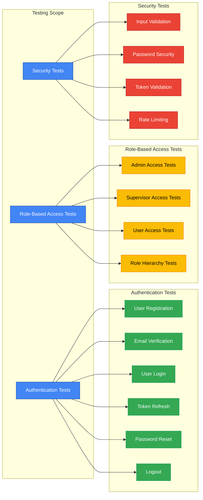

### Testing Automation

The system provides both automated and interactive testing approaches:

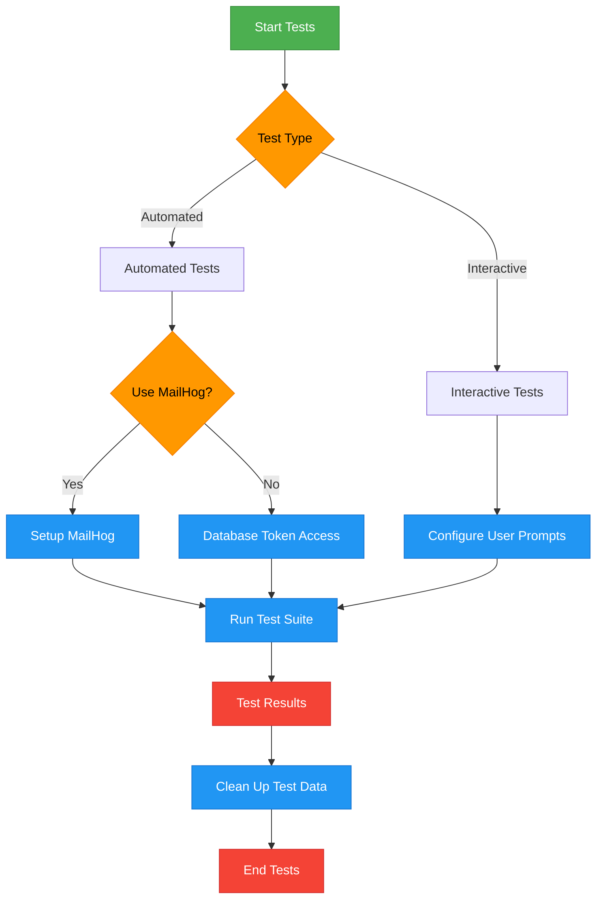

---

## Security Considerations

The system implements several security measures:

1. **Password Security**: 
   - Passwords are hashed using bcrypt before storage
   - Password complexity requirements enforced

2. **Token Management**:
   - Short-lived access tokens (15 minutes by default)
   - Refresh tokens with secure rotation
   - Token storage in HTTP-only cookies as an option

3. **API Security**:
   - Rate limiting on authentication endpoints
   - CORS configuration
   - Helmet for HTTP header security

4. **Data Protection**:
   - Input validation
   - Prevention of user enumeration
   - Automatic cleanup of expired tokens and verification records

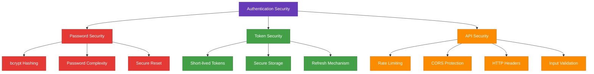

---

This technical documentation provides a comprehensive overview of the TypeScript Authentication System architecture, workflows, and testing methodology. For specific implementation details, refer to the source code and comments within individual files.