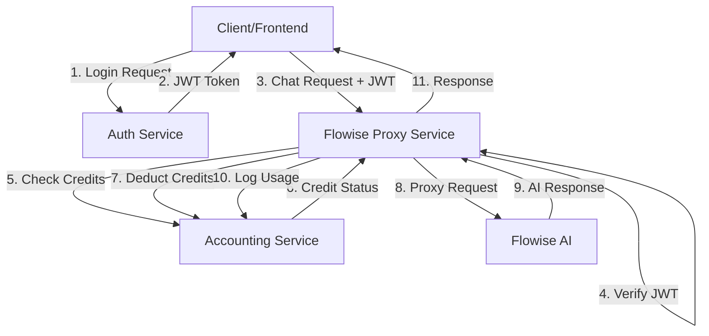

# Service Architecture Documentation

## Table of Contents
1. [Overview](#overview)
2. [Service Descriptions](#service-descriptions)
3. [Service Relationships](#service-relationships)
4. [Authentication Flow](#authentication-flow)
5. [Credit Management Flow](#credit-management-flow)
6. [Chat Request Flow](#chat-request-flow)
7. [Technology Stack](#technology-stack)
8. [API Communication](#api-communication)
9. [Database Architecture](#database-architecture)
10. [Deployment Architecture](#deployment-architecture)

---

## Overview

The platform consists of three microservices that work together to provide a secure, credit-based chat proxy system for Flowise AI:

```
┌─────────────────┐      ┌──────────────────────┐      ┌─────────────────────┐
│   Auth Service  │◄────►│ Flowise Proxy Service│◄────►│ Accounting Service  │
│   (Port 3000)   │      │    (Port 8000)       │      │    (Port 3001)      │
└─────────────────┘      └──────────────────────┘      └─────────────────────┘
        │                          │                              │
        ▼                          ▼                              ▼
  [MongoDB]                   [MongoDB]                    [PostgreSQL]
  User accounts               Chat sessions                Credit tracking
  JWT tokens                  File storage                 Usage logs
```

---

## Service Descriptions

### 1. Auth Service
- **Language**: TypeScript/Node.js with Express
- **Port**: 3000
- **Database**: MongoDB
- **Primary Responsibilities**:
  - User registration and email verification
  - User authentication (login/logout)
  - JWT token generation (access & refresh tokens)
  - Password reset functionality
  - Role-based access control (Admin, Supervisor, EndUser)
  - User profile management

### 2. Flowise Proxy Service
- **Language**: Python with FastAPI
- **Port**: 8000
- **Database**: MongoDB
- **Primary Responsibilities**:
  - Proxy requests to Flowise AI API
  - JWT authentication verification
  - Credit checking before chat operations
  - Chat session management
  - File upload and storage management
  - Chat history tracking
  - Integration with external authentication and accounting services

### 3. Accounting Service
- **Language**: TypeScript/Node.js with Express
- **Port**: 3001
- **Database**: PostgreSQL with Sequelize ORM
- **Primary Responsibilities**:
  - Credit allocation and management
  - Credit balance tracking
  - Usage recording and statistics
  - Streaming session management
  - Transaction logging
  - User account synchronization with auth service

---

## Service Relationships

### Primary Dependencies



### Service Interactions

#### Auth Service → Other Services
- **Outbound**: None (Auth service is independent)
- **Inbound**: 
  - Flowise Proxy Service validates JWT tokens using shared secret
  - Accounting Service validates JWT tokens using shared secret
  - Both services extract user info from JWT payload

#### Flowise Proxy Service → Other Services
- **To Auth Service**:
  - `POST /api/auth/login` - User authentication
  - `POST /api/auth/refresh` - Token refresh
  - `GET /api/admin/users` - Fetch user list
  - User permission validation
  
- **To Accounting Service**:
  - `GET /api/credits/total-balance` - Check user credits
  - `POST /api/credits/deduct` - Deduct credits for operations
  - `POST /api/credits/calculate` - Calculate operation costs
  - `POST /api/usage/record` - Log transactions

- **To Flowise AI**:
  - Direct proxy of chat prediction requests
  - Chatflow synchronization

#### Accounting Service → Other Services
- **Outbound**: None (receives JWT tokens validated locally)
- **Inbound**: 
  - Flowise Proxy Service for credit operations
  - Direct admin requests for credit management

---

## Authentication Flow

### 1. User Login Sequence

```
┌──────┐         ┌──────────┐         ┌─────────────┐
│Client│         │Auth Svc  │         │   MongoDB   │
└──┬───┘         └────┬─────┘         └──────┬──────┘
   │                  │                       │
   │ POST /api/auth/login                    │
   │ {username, password}                    │
   ├─────────────────►│                       │
   │                  │                       │
   │                  │ Validate credentials  │
   │                  ├──────────────────────►│
   │                  │◄──────────────────────┤
   │                  │                       │
   │                  │ Generate JWT          │
   │                  │ (access + refresh)    │
   │                  │                       │
   │ {accessToken,    │                       │
   │  refreshToken,   │                       │
   │  user{...}}      │                       │
   │◄─────────────────┤                       │
   │                  │                       │
```

### 2. JWT Token Structure

**Access Token Payload:**
```json
{
  "sub": "user_id_123",
  "username": "john_doe",
  "email": "john@example.com",
  "role": "enduser",
  "type": "access",
  "iat": 1234567890,
  "exp": 1234568790
}
```

**Shared Secret:**
- All services use the same `JWT_ACCESS_SECRET` environment variable
- This allows each service to independently verify tokens without calling auth service

### 3. Token Verification in Services

**In Flowise Proxy Service** (`app/auth/middleware.py`):
```python
# Validates JWT and extracts user info
async def authenticate_user(credentials: HTTPAuthorizationCredentials):
    token = credentials.credentials
    payload = jwt.decode(token, settings.JWT_ACCESS_SECRET, algorithms=[settings.JWT_ALGORITHM])
    # Returns user info including user_id, username, email, role
```

**In Accounting Service** (`src/middleware/jwt.middleware.ts`):
```typescript
// Validates JWT and syncs user account
export const authenticateJWT = async (req, res, next) => {
    const token = authHeader.split(' ')[1];
    const decoded = jwt.verify(token, process.env.JWT_ACCESS_SECRET);
    // Creates or finds user account in local DB
    // Attaches user info to req.user
}
```

---

## Credit Management Flow

### 1. Credit Allocation (Admin)

```
┌─────┐         ┌───────────────┐         ┌────────────┐
│Admin│         │Accounting Svc │         │PostgreSQL  │
└──┬──┘         └───────┬───────┘         └─────┬──────┘
   │                    │                        │
   │ POST /api/credits/allocate                 │
   │ {userId, credits, expiryDays}              │
   ├───────────────────►│                        │
   │                    │                        │
   │                    │ Validate JWT (Admin)   │
   │                    │                        │
   │                    │ Create credit_allocation│
   │                    ├───────────────────────►│
   │                    │                        │
   │                    │ Update user balance    │
   │                    ├───────────────────────►│
   │                    │◄───────────────────────┤
   │                    │                        │
   │ {success: true,    │                        │
   │  newBalance: 1000} │                        │
   │◄───────────────────┤                        │
```

### 2. Credit Check & Deduction Flow

```
┌────────────┐         ┌────────────────┐         ┌───────────────┐
│Flowise Svc │         │Accounting Svc  │         │ PostgreSQL    │
└─────┬──────┘         └────────┬───────┘         └───────┬───────┘
      │                         │                         │
      │ GET /api/credits/total-balance                   │
      │ Authorization: Bearer <JWT>                      │
      ├────────────────────────►│                         │
      │                         │                         │
      │                         │ Query user credits     │
      │                         ├────────────────────────►│
      │                         │◄────────────────────────┤
      │                         │                         │
      │ {totalCredits: 500}     │                         │
      │◄────────────────────────┤                         │
      │                         │                         │
      │ POST /api/credits/deduct                         │
      │ {credits: 10}           │                         │
      ├────────────────────────►│                         │
      │                         │                         │
      │                         │ Deduct credits          │
      │                         ├────────────────────────►│
      │                         │                         │
      │                         │ Create credit_transaction│
      │                         ├────────────────────────►│
      │                         │◄────────────────────────┤
      │                         │                         │
      │ {success: true,         │                         │
      │  newBalance: 490}       │                         │
      │◄────────────────────────┤                         │
```

---

## Chat Request Flow

### Complete End-to-End Flow

```
┌──────┐  ┌────────────┐  ┌───────────────┐  ┌──────────┐  ┌─────────┐
│Client│  │Flowise Svc │  │Accounting Svc │  │Auth Svc  │  │Flowise  │
└──┬───┘  └─────┬──────┘  └───────┬───────┘  └────┬─────┘  └────┬────┘
   │            │                  │               │             │
   │ 1. Login   │                  │               │             │
   ├───────────────────────────────────────────────►             │
   │◄──────────────────────────────────────────────┤             │
   │ JWT Token  │                  │               │             │
   │            │                  │               │             │
   │ 2. POST /api/v1/chat/predict │               │             │
   │ {chatflow_id, question}      │               │             │
   │ Authorization: Bearer <JWT>   │               │             │
   ├───────────►│                  │               │             │
   │            │                  │               │             │
   │            │ 3. Verify JWT    │               │             │
   │            │ (using shared secret)            │             │
   │            │                  │               │             │
   │            │ 4. Check Credits │               │             │
   │            ├─────────────────►│               │             │
   │            │◄─────────────────┤               │             │
   │            │ {totalCredits}   │               │             │
   │            │                  │               │             │
   │            │ 5. Deduct Credits│               │             │
   │            ├─────────────────►│               │             │
   │            │◄─────────────────┤               │             │
   │            │ {success: true}  │               │             │
   │            │                  │               │             │
   │            │ 6. Proxy Chat Request            │             │
   │            ├──────────────────────────────────────────────►│
   │            │                  │               │             │
   │            │ 7. AI Response (streaming)       │             │
   │            │◄──────────────────────────────────────────────┤
   │            │                  │               │             │
   │            │ 8. Save to MongoDB               │             │
   │            │ (chat_sessions, chat_messages)   │             │
   │            │                  │               │             │
   │            │ 9. Log Transaction               │             │
   │            ├─────────────────►│               │             │
   │            │                  │               │             │
   │ 10. Response                 │               │             │
   │◄───────────┤                  │               │             │
```

### Key Steps Explained

1. **Authentication**: Client authenticates with Auth Service, receives JWT
2. **Request Initiation**: Client sends chat request to Flowise Proxy with JWT
3. **JWT Verification**: Proxy verifies JWT using shared secret (no auth service call needed)
4. **Credit Check**: Proxy queries Accounting Service for user's credit balance
5. **Credit Deduction**: If sufficient credits, Proxy deducts cost from user's account
6. **Proxy to Flowise**: Proxy forwards request to actual Flowise AI API
7. **Stream Response**: Flowise AI streams response back through proxy
8. **Save History**: Proxy saves chat message to MongoDB for history
9. **Log Transaction**: Proxy logs usage to Accounting Service for audit
10. **Return to Client**: Proxy returns AI response to client

---

## Technology Stack

### Auth Service (TypeScript/Express)
```
Dependencies:
├── express (Web framework)
├── mongoose (MongoDB ODM)
├── jsonwebtoken (JWT generation)
├── bcryptjs (Password hashing)
├── nodemailer (Email service)
├── helmet (Security headers)
├── express-rate-limit (Rate limiting)
└── winston (Logging)
```

### Flowise Proxy Service (Python/FastAPI)
```
Dependencies:
├── fastapi (Web framework)
├── motor (Async MongoDB driver)
├── beanie (Async MongoDB ODM)
├── pyjwt (JWT verification)
├── httpx (HTTP client)
├── flowise (Flowise SDK)
├── uvicorn (ASGI server)
└── pydantic (Data validation)
```

### Accounting Service (TypeScript/Express)
```
Dependencies:
├── express (Web framework)
├── sequelize (PostgreSQL ORM)
├── pg (PostgreSQL driver)
├── jsonwebtoken (JWT verification)
├── uuid (UUID generation)
├── helmet (Security headers)
├── express-rate-limit (Rate limiting)
└── winston (Logging)
```

---

## API Communication

### Environment Variables for Service Discovery

**In Flowise Proxy Service (.env):**
```env
# Authentication Service
EXTERNAL_AUTH_URL=http://auth-service:3000/api
AUTH_API_URL=http://auth-service:3000

# Accounting Service
ACCOUNTING_SERVICE_URL=http://accounting-service:3001/api
ACCOUNTING_API_URL=http://accounting-service:3001

# Shared JWT Secret (CRITICAL - must match across all services)
JWT_ACCESS_SECRET=same_secret_across_all_services
JWT_REFRESH_SECRET=same_secret_for_refresh_tokens

# Flowise AI
FLOWISE_API_URL=https://flowise-api-endpoint.com
FLOWISE_API_KEY=your_flowise_api_key
```

**In Accounting Service (.env):**
```env
# JWT Secrets (must match Auth Service)
JWT_ACCESS_SECRET=same_secret_across_all_services

# Database
DB_HOST=postgres
DB_PORT=5432
DB_NAME=accounting_db
DB_USER=postgres
DB_PASSWORD=password
```

**In Auth Service (.env):**
```env
# JWT Secrets (must match other services)
JWT_ACCESS_SECRET=same_secret_across_all_services
JWT_REFRESH_SECRET=same_secret_for_refresh_tokens

# Database
MONGODB_URI=mongodb://mongodb:27017/auth_db
```

### Key API Endpoints

#### Auth Service → External
| Endpoint | Method | Purpose |
|----------|--------|---------|
| `/api/auth/signup` | POST | User registration |
| `/api/auth/login` | POST | User authentication |
| `/api/auth/refresh` | POST | Token refresh |
| `/api/admin/users` | GET | List all users |
| `/api/profile` | GET | Get user profile |

#### Flowise Proxy → Auth Service
| Endpoint | Method | Used For |
|----------|--------|----------|
| `/api/auth/login` | POST | External user login |
| `/api/admin/users` | GET | Sync user list |

#### Flowise Proxy → Accounting Service
| Endpoint | Method | Used For |
|----------|--------|----------|
| `/api/credits/total-balance` | GET | Check credits |
| `/api/credits/deduct` | POST | Deduct credits |
| `/api/credits/calculate` | POST | Calculate cost |
| `/api/usage/record` | POST | Log transactions |

#### Accounting Service → External
| Endpoint | Method | Purpose |
|----------|--------|---------|
| `/api/credits/balance` | GET | Get user balance |
| `/api/credits/allocate` | POST | Allocate credits |
| `/api/credits/deduct` | POST | Deduct credits |
| `/api/streaming-sessions/*` | Various | Streaming session management |
| `/api/usage/record` | POST | Record usage |

---

## Database Architecture

### Auth Service (MongoDB)

**Collections:**
```
users
├── _id: ObjectId
├── username: String (unique)
├── email: String (unique)
├── password: String (hashed)
├── role: String (admin, supervisor, enduser)
├── isVerified: Boolean
├── verificationCode: String
└── timestamps

refresh_tokens
├── _id: ObjectId
├── userId: ObjectId
├── token: String
├── expiresAt: Date
└── createdAt: Date
```

### Flowise Proxy Service (MongoDB)

**Collections:**
```
users (synced from auth service)
├── _id: String (user_id from JWT)
├── username: String
├── email: String
├── role: String
└── timestamps

chatflows
├── _id: ObjectId
├── chatflow_id: String
├── name: String
├── is_public: Boolean
└── allowed_users: [String]

chat_sessions
├── _id: ObjectId
├── session_id: String (unique)
├── user_id: String
├── chatflow_id: String
├── created_at: DateTime
└── updated_at: DateTime

chat_messages
├── _id: ObjectId
├── session_id: String
├── message_id: String
├── role: String (user/assistant)
├── content: String
├── timestamp: DateTime
└── metadata: Object

file_storage
├── _id: ObjectId
├── file_id: String
├── filename: String
├── content_type: String
├── data: Binary
└── uploaded_at: DateTime
```

### Accounting Service (PostgreSQL)

**Tables:**
```sql
user_accounts
├── user_id: VARCHAR (PK, from JWT 'sub')
├── username: VARCHAR
├── email: VARCHAR
├── role: VARCHAR
├── total_credits: INTEGER
├── created_at: TIMESTAMP
└── updated_at: TIMESTAMP

credit_allocations
├── id: UUID (PK)
├── user_id: VARCHAR (FK)
├── credits: INTEGER
├── expires_at: TIMESTAMP
├── allocated_at: TIMESTAMP
└── notes: TEXT

credit_transactions
├── id: UUID (PK)
├── user_id: VARCHAR (FK)
├── transaction_type: ENUM (deduction, allocation, adjustment)
├── amount: INTEGER
├── balance_after: INTEGER
├── description: TEXT
└── created_at: TIMESTAMP

usage_logs
├── id: UUID (PK)
├── user_id: VARCHAR (FK)
├── service: VARCHAR
├── operation: VARCHAR
├── credits: INTEGER
├── metadata: JSONB
└── timestamp: TIMESTAMP

streaming_sessions
├── id: UUID (PK)
├── session_id: VARCHAR (unique)
├── user_id: VARCHAR (FK)
├── model_id: VARCHAR
├── status: ENUM (active, completed, aborted)
├── estimated_cost: INTEGER
├── actual_cost: INTEGER
├── created_at: TIMESTAMP
└── updated_at: TIMESTAMP
```

---

## Deployment Architecture

### Docker Compose Network

```yaml
# Network structure across services
networks:
  app-network:
    driver: bridge

# Services communicate via container names:
# - auth-service:3000
# - flowise-proxy:8000
# - accounting-service:3001
# - mongodb:27017
# - postgres:5432
```

### Container Communication

```
┌─────────────────────────────────────────────────────┐
│               Docker Network (app-network)          │
│                                                     │
│  ┌──────────────┐    ┌──────────────────┐         │
│  │ auth-service │    │ flowise-proxy    │         │
│  │   :3000      │    │      :8000       │         │
│  └──────┬───────┘    └────────┬─────────┘         │
│         │                     │                    │
│         │                     │                    │
│  ┌──────▼───────┐    ┌────────▼─────────┐         │
│  │   mongodb    │    │  accounting-svc  │         │
│  │   :27017     │    │      :3001       │         │
│  └──────────────┘    └────────┬─────────┘         │
│                               │                    │
│                      ┌────────▼─────────┐         │
│                      │   postgres       │         │
│                      │     :5432        │         │
│                      └──────────────────┘         │
└─────────────────────────────────────────────────────┘
         │                     │
         │                     │
         ▼                     ▼
    Host:3000              Host:8000
```

### Port Mappings

| Service | Internal Port | External Port | Protocol |
|---------|--------------|---------------|----------|
| Auth Service | 3000 | 3000 | HTTP |
| Flowise Proxy | 8000 | 8000 | HTTP |
| Accounting Service | 3001 | 3001 | HTTP |
| MongoDB (Auth) | 27017 | 27017 | TCP |
| MongoDB (Proxy) | 27017 | 27020 | TCP |
| PostgreSQL | 5432 | 5432 | TCP |

---

## Security Considerations

### 1. JWT Token Security
- **Shared Secret**: All services must use the same `JWT_ACCESS_SECRET`
- **Token Types**: Access tokens (short-lived, 15 min) and Refresh tokens (7 days)
- **Validation**: Each service independently validates tokens without calling auth service
- **Algorithm**: HS256 (HMAC with SHA-256)

### 2. Service-to-Service Authentication
- Services communicate via internal Docker network
- JWT tokens passed in Authorization headers
- No additional service authentication layer (relies on network isolation)

### 3. Database Security
- Each service has its own isolated database
- No direct database access between services
- User account synchronization via JWT claims

### 4. Role-Based Access Control
- **Admin**: Full system access, credit management, user management
- **Supervisor**: Reports access, limited credit management
- **EndUser**: Own profile, chat access, credit balance viewing

---

## Common Workflows

### 1. New User Registration
```
Client → Auth Service: POST /api/auth/signup
Auth Service → MongoDB: Create user document
Auth Service → Email Service: Send verification email
Client → Auth Service: POST /api/auth/verify-email
Auth Service → MongoDB: Mark user as verified
Admin → Accounting Service: POST /api/credits/allocate
Accounting Service → PostgreSQL: Create user_account & credit_allocation
```

### 2. User Chat Session
```
Client → Auth Service: POST /api/auth/login (get JWT)
Client → Flowise Proxy: POST /api/v1/chat/predict (with JWT)
Flowise Proxy: Verify JWT locally
Flowise Proxy → Accounting Service: GET /api/credits/total-balance
Flowise Proxy → Accounting Service: POST /api/credits/deduct
Flowise Proxy → Flowise AI: Proxy chat request
Flowise Proxy → MongoDB: Save chat_message
Flowise Proxy → Accounting Service: POST /api/usage/record
Flowise Proxy → Client: Return AI response
```

### 3. Admin Credit Management
```
Admin → Auth Service: POST /api/auth/login (get admin JWT)
Admin → Accounting Service: POST /api/credits/allocate (with admin JWT)
Accounting Service: Verify JWT, check admin role
Accounting Service → PostgreSQL: Create credit_allocation
Accounting Service → PostgreSQL: Update user_accounts.total_credits
Accounting Service → Admin: Return success + new balance
```

---

## Troubleshooting

### Common Issues

1. **JWT Verification Failures**
   - Ensure `JWT_ACCESS_SECRET` is identical across all services
   - Check token expiration times
   - Verify token type is 'access' not 'refresh'

2. **Service Communication Failures**
   - Verify Docker network connectivity
   - Check container names match environment variables
   - Ensure services are on same Docker network

3. **Credit Deduction Failures**
   - Verify user account exists in accounting service
   - Check sufficient credit balance
   - Ensure JWT contains valid user_id (sub claim)

4. **User Not Found Issues**
   - Accounting service auto-creates users from JWT
   - Verify JWT contains all required claims (sub, username, email, role)
   - Check database connectivity

---

## Conclusion

This three-service architecture provides a secure, scalable, and maintainable platform for managing AI chat operations with credit-based access control. The services are loosely coupled through JWT authentication and REST APIs, allowing independent scaling and development while maintaining consistency through shared JWT secrets and well-defined interfaces.

### Key Architectural Benefits:
- **Separation of Concerns**: Each service has a clear, focused responsibility
- **Independent Scalability**: Services can be scaled independently based on load
- **Security**: JWT-based authentication with role-based access control
- **Auditability**: Comprehensive logging of all credit transactions and usage
- **Flexibility**: Easy to add new services or modify existing ones
- **Resilience**: Service failures are isolated and don't cascade

### Integration Points:
- **Auth ↔ Proxy**: JWT token validation, user authentication
- **Proxy ↔ Accounting**: Credit management, usage tracking
- **Proxy ↔ Flowise**: AI chat operations
- All services share JWT secret for token validation
